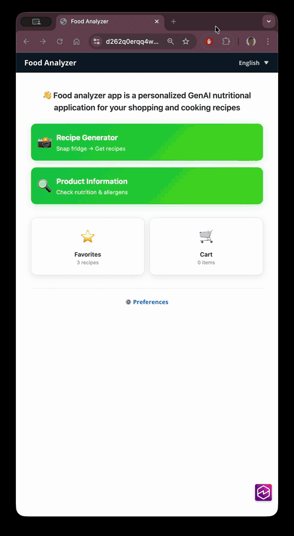
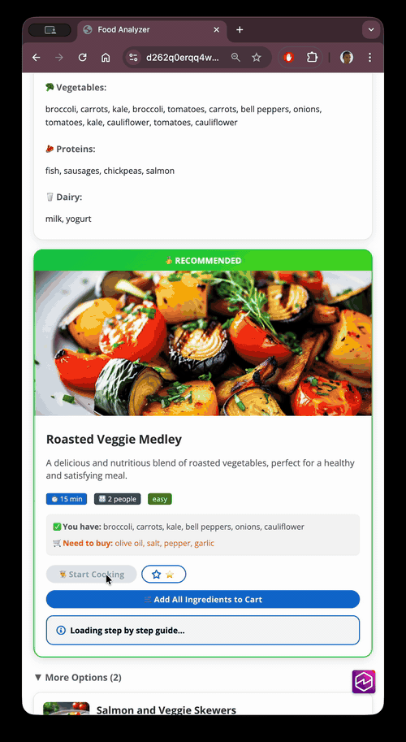
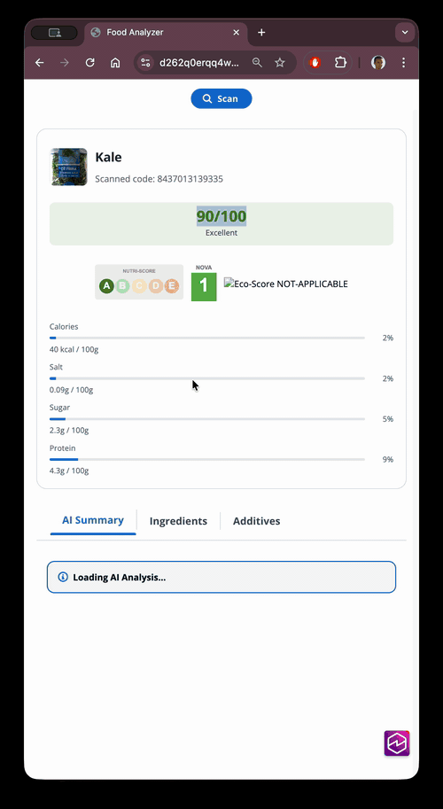
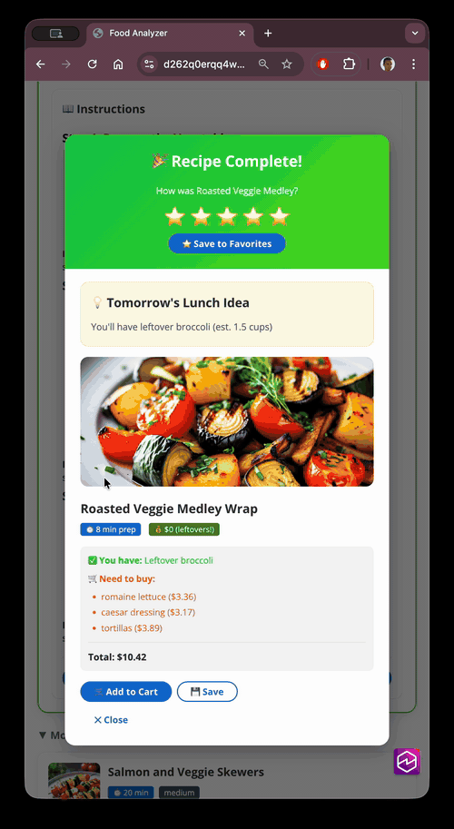
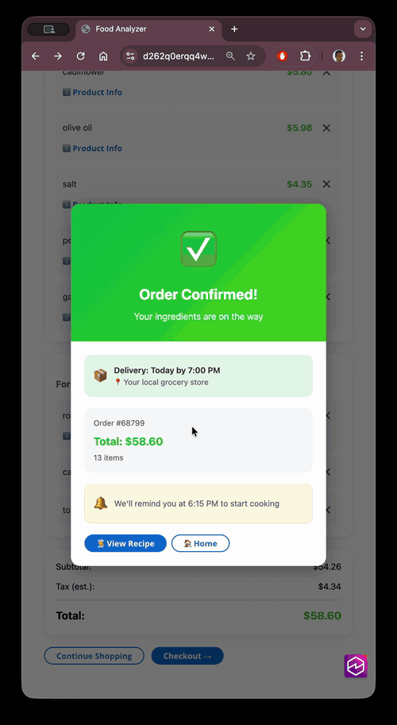

# Recipe-First Shopping Assistant

**A GenAI-powered grocery shopping platform that transforms how customers shop by starting with recipes, not products.** Built with serverless architecture and generative AI to showcase the future of grocery retail. Traditional grocery shopping means browsing aisles, adding random items, and wondering what to cook. **Recipe-First Shopping** flips this model: photo your fridge → get personalized recipes → auto-add missing ingredients → cook tonight. This approach increases basket as customers add missing recipe ingredients in one click, reduces food waste through recipes that use existing ingredients first and enables quick reorder with favorite recipes.

> **Note**: This is a technology showcase demonstrating recipe-to-cart integration patterns for grocery retailers. Mock pricing and checkout flows simulate production integration points.

## Demo



## Table of Contents

- [Project Structure](#project-structure)
- [Core Features](#core-features)
- [Customer Journey](#customer-journey)
- [Architecture](#architecture)
- [Technical Implementation](#technical-implementation)
- [Installation](#installation)
- [Integration Points](#integration-points)

## Project Structure

```
serverless-genai-food-analyzer-app/
├── bin/
│   └── food-analyzer-stack.ts          # CDK app entry point
├── lib/
│   ├── food-analyzer-stack.ts          # Main stack definition
│   ├── auth.ts                         # Cognito configuration
│   ├── dashboard.ts                    # CloudWatch dashboard
│   └── load-database-construct.ts      # Open Food Facts loader
├── lambda/
│   ├── barcode_ingredients/            # Product data + ingredient descriptions
│   ├── barcode_product_summary/        # Personalized product summaries
│   ├── barcode_image/                  # Product visualizations
│   ├── recipe_image_ingredients/       # Fridge photo analysis
│   ├── recipe_proposals/               # Recipe generation
│   ├── recipe_step_by_step/            # Cooking instructions
│   └── auth/                           # Lambda@Edge authentication
├── resources/ui/                       # React frontend (Vite)
│   ├── src/
│   │   ├── pages/components/
│   │   │   ├── barcode.tsx             # Barcode scanning interface
│   │   │   ├── barcode_product_summary.tsx  # Product details
│   │   │   ├── recipe_proposals.tsx    # Recipe display
│   │   │   ├── cart.tsx                # Shopping cart
│   │   │   ├── favorites.tsx           # Saved recipes
│   │   │   ├── checkout-success.tsx    # Order confirmation
│   │   │   ├── leftover-suggestion.tsx # Leftover recipes
│   │   │   └── preferences.tsx         # User preferences
│   │   └── utils/
│   │       └── ingredient-mapping.ts   # Mock pricing + barcode mapping
│   └── public/
└── img/                                # Demo images + sample fridges
```

## Core Features

### 1. Recipe-to-Cart Conversion

**One-Click Ingredient Addition**
- Photo your fridge → AI detects what you have
- Get 3 personalized recipe suggestions
- See what ingredients are missing from the recipe
- Add ALL missing ingredients to cart in one click

**Recipe Display**:
- ✅ **You have**: chicken, tomatoes, onions
- 🛒 **Need to buy**: feta cheese, olive oil
- **[🛒 Add All Ingredients to Cart]** ← Primary action



### 2. Barcode Scanning (Kiosk Mode)

**In-Store Product Analysis**
- Scan any product barcode for instant personalized information
- Works as standalone kiosk or in-app feature
- Analyzes products against user's dietary profile
- Available from main menu for quick product lookup

**What Customers Get**:
- Personalized nutritional summary based on health goals
- Ingredient explanations in simple language
- Allergen warnings (matched to user profile)
- Dietary compatibility (vegan, keto, halal, kosher, etc.)
- AI-generated product visualization
- Data from Open Food Facts database

**Use Cases**:
- **In-store kiosk**: Customers scan products while shopping
- **Cart review**: Analyze products already in cart
- **Product comparison**: Compare similar products side-by-side
- **Dietary validation**: Verify product matches dietary restrictions



### 3. Personalization Engine (6 Dimensions)

Every recipe and product analysis respects ALL user preferences:

1. **Allergies**: eggs, nuts, gluten, dairy, shellfish, soy
2. **Dietary Preferences**: vegan, vegetarian, keto, paleo, low-carb, gluten-free
3. **Health Goals**: weight loss, muscle gain, maintain weight, general health
4. **Religious Requirements**: halal, kosher, hindu dietary laws
5. **Disliked Ingredients**: cilantro, mushrooms, onions, garlic, spicy foods
6. **Favorite Cuisines**: Italian, Asian, Mexican, Mediterranean, French, Indian

### 4. Smart Shopping Cart

**Features**:
- Items grouped by recipe for context
- Shows which recipe each ingredient belongs to
- Links to product details (barcode scan)
- Subtotal calculation
- Journey progress indicator
- Continue shopping or proceed to checkout



### 5. Favorites & Quick Reorder

**Saved Recipes**:
- Save recipes with one tap
- One-click reorder all ingredients
- View saved date and rating
- Expandable recipe details
- Drives repeat purchases



### 6. Leftover Optimization

**After Cooking**:
- Rate your completed recipe
- AI suggests leftover recipe for next day
- Shows new ingredients needed with pricing
- Add to cart or save for later
- Reduces food waste, drives next-day sales

## Customer Journey


```
1. Customer takes fridge photo (or selects demo)
   ↓
2. Claude (vision) detects ingredients
   ↓
3. Claude generates 3 personalized recipes respecting user preferences
   ↓
4. Customer sees recipe and ingredients
   - ✅ You have: chicken, tomatoes
   - 🛒 Need to buy: feta, olive oil
   ↓
5. Customer clicks "Add All Ingredients to Cart"
   - System adds missing ingredients with pricing
   - Shows cart success modal
   ↓
6. Customer reviews cart
   - Items grouped by recipe
   - Can remove individual items
   - See total with tax
   ↓
7. Customer checks out
   - Mock order confirmation
   - Delivery scheduling
   - Cooking reminder set
   ↓
8. Customer starts cooking
   - Claude streams instructions
   - Real-time step-by-step guidance
   ↓
9. Customer completes recipe
   - Rate recipe (1-5 stars)
   - Save to favorites
   - Get leftover suggestion
   ↓
10. Leftover recipe suggested
    - "Chicken Wrap" for tomorrow
    - Add to cart or save
```

### Complete Flow: Barcode Scanning

```
1. Customer scans product barcode
   ↓
2. Lambda fetches product data from Open Food Facts
   ↓
3. Claude generates personalized summary
   - Matches against user allergies
   - Evaluates for dietary preferences
   - Assesses nutritional fit for health goals
   - Checks religious requirements
   ↓
4. Nova Canvas generates product visualization
   ↓
5. Customer sees personalized analysis
   - Allergen warnings (if applicable)
   - Nutritional recommendations
   - Dietary compatibility
   - Ingredient explanations
```

## Architecture

### High-Level Architecture

```
┌─────────────────────────────────────────────────────────────┐
│ FRONTEND & AUTH                                             │
│ CloudFront → S3 (React) → Cognito → Lambda@Edge            │
└─────────────────────────────────────────────────────────────┘
                            ↓
┌─────────────────────────────────────────────────────────────┐
│ RECIPE GENERATION                                           │
│ Lambda → Bedrock (Claude Haiku 4.5 + Nova Canvas)           │
└─────────────────────────────────────────────────────────────┘
                            ↓
┌─────────────────────────────────────────────────────────────┐
│ CART & CHECKOUT (MOCK)                                      │
│ Frontend (localStorage) → Mock Pricing → Mock Order        │
└─────────────────────────────────────────────────────────────┘
                            ↓
┌─────────────────────────────────────────────────────────────┐
│ BARCODE SCANNING                                            │
│ Lambda → Open Food Facts API → Bedrock → DynamoDB          │
└─────────────────────────────────────────────────────────────┘
```

[PLACEHOLDER: Add detailed architecture diagram]

### AWS Services

| Service | Purpose |
|---------|---------|
| **Amazon Bedrock** | Claude Haiku 4.5 (vision, recipes), Claude Haiku (streaming), Nova Canvas (images) |
| **AWS Lambda** | 6 serverless functions (Python 3.14, Node.js 24.x) |
| **Lambda@Edge** | Cognito JWT validation + SigV4 request signing |
| **Amazon DynamoDB** | Product catalog, recipe cache, personalized summaries |
| **Amazon S3** | Frontend hosting, AI-generated images |
| **Amazon CloudFront** | Global CDN with Origin Access Control |
| **Amazon Cognito** | User authentication and authorization |
| **AWS IAM** | Secure Lambda URL access control |
| **CloudWatch** | Logging, monitoring, dashboards |

### Lambda Functions

| Function | Runtime | Purpose | Bedrock Model |
|----------|---------|---------|---------------|
| `barcode_ingredients` | Python 3.14 | Fetch product data, generate ingredient descriptions | Claude Haiku 4.5 |
| `barcode_product_summary` | Node.js 24.x | Generate personalized product summaries (streaming) | Claude 3 Haiku |
| `barcode_image` | Python 3.14 | Generate product visualizations | Nova Canvas |
| `recipe_image_ingredients` | Python 3.14 | Extract ingredients from fridge photos | Claude Haiku 4.5 (vision) |
| `recipe_proposals` | Python 3.14 | Generate 3 personalized recipes with images | Claude Haiku 4.5 + Nova Canvas |
| `recipe_step_by_step` | Node.js 24.x | Stream cooking instructions | Claude 3 Haiku |
| `auth` (Edge) | Node.js 24.x | JWT validation + SigV4 signing | N/A |

## Technical Implementation

### Security Architecture

**All Lambda URLs use IAM authentication**:
```typescript
authType: lambda.FunctionUrlAuthType.AWS_IAM
```

**Authentication Flow**:
1. User authenticates with Cognito
2. Receives JWT token
3. Lambda@Edge validates JWT
4. Signs request with SigV4
5. Lambda executes with IAM authorization

**S3 Buckets**: Private with `BlockPublicAccess.BLOCK_ALL`  
**CloudFront**: Origin Access Control (OAC) for S3 access  
**Cognito**: Self-registration disabled, admin-only user creation

### GenAI Model Selection

| Use Case | Model | Rationale |
|----------|-------|-----------|
| Barcode product summary | Claude Haiku | Fast streaming, cost-effective |
| Barcode product image | Nova Canvas | Cost-effective, high quality |
| Fridge photo analysis | Claude Haiku 4.5 | Vision capability, high accuracy |
| Recipe generation | Claude Haiku 4.5 | Complex reasoning, JSON output |
| Cooking instructions | Claude Haiku | Fast streaming, good UX |
| Recipe images | Nova Canvas | Cost-effective, appetizing results |

### Data Storage

**DynamoDB Tables**:
- `openFoodFactsProductsTable`: Product catalog (PK: product_code)
- `ProductsTable`: Processed products (PK: product_code, SK: language)
- `ProductsSummaryTable`: Cached product summaries (PK: product_code, SK: params_hash)
- `IngredientCacheTable`: Cached ingredient detection (PK: image_hash)
- `RecipeCacheTable`: Cached recipe generation (PK: ingredients_hash, SK: params_hash)

**LocalStorage** (Frontend):
- `userPreferences`: 6-dimensional preference data
- `shoppingCart`: Cart items with recipe context
- `favoriteRecipes`: Saved recipes with ratings

## Installation

### Prerequisites

- [Node.js 18+](https://nodejs.org/)
- [AWS CLI 2+](https://docs.aws.amazon.com/cli/latest/userguide/getting-started-install.html)
- AWS Account with Bedrock access (Claude 3 and Nova models)

### Deploy to AWS

```bash
# Install dependencies
npm install

# Deploy infrastructure (use us-east-1 for simplicity)
cdk deploy

# Output will include CloudFront URL
```

### Create Demo User

1. Navigate to AWS Console → Amazon Cognito
2. Find user pool: `AuthenticationFoodAnalyzerUserPoolXXX`
3. Create user (admin-only, self-registration disabled)
4. Access app via CloudFront URL from CDK output

### Run Locally

```bash
# 1. Deploy infrastructure first
cdk deploy

# 2. Download aws-exports.json from CloudFront
curl https://dxxxxxxxxxxxx.cloudfront.net/aws-exports.json \
  -o resources/ui/public/aws-exports.json

# 3. Start local dev server
cd resources/ui
npm install
npm run dev
```

## Integration Points

### Current Implementation (Showcase)

**Mock Integrations**:
```typescript
// Mock pricing engine
getMockPrice(ingredient: string): number

// Mock checkout
{
  orderNumber: "12345",
  deliveryTime: "Today by 7:00 PM",
  status: "confirmed"
}

// LocalStorage persistence
localStorage.setItem("shoppingCart", JSON.stringify(cartItems));
localStorage.setItem("favoriteRecipes", JSON.stringify(favorites));
```

### Production Integration Requirements

**For Real Grocery Deployment**:

1. **Product Catalog API**
   ```typescript
   POST /api/matchProduct
   {
     ingredient: "feta cheese",
     storeId: "walmart-5234",
     zipCode: "98101"
   }
   Response: {
     sku: "12345678",
     barcode: "3176582033563",
     productName: "Athenos Feta Cheese",
     price: 4.99,
     inStock: true
   }
   ```

2. **Checkout API**
   ```typescript
   POST /api/checkout
   {
     cartItems: [...],
     userId: "user-123",
     storeId: "walmart-5234",
     deliveryAddress: {...}
   }
   Response: {
     orderId: "ORD-789456",
     deliveryWindow: {...}
   }
   ```

3. **Store Locator API**
   ```typescript
   GET /api/stores?lat=47.6062&lng=-122.3321&radius=10
   Response: {
     stores: [{storeId, name, distance, deliveryAvailable}]
   }
   ```


## Runtime Versions

- **Node.js 24.x** - TypeScript Lambda functions (upgraded Dec 2025)
- **Python 3.14** - Python Lambda functions

## Documentation

### Technical Documentation
For detailed technical information, see the [docs/](docs/) directory:
- [Codebase Overview](docs/codebase_info.md) - Project statistics and complexity analysis
- [Architecture Details](docs/architecture.md) - System design and data flow
- [Component Reference](docs/components.md) - All 7 Lambda functions and 8 frontend pages
- [API Specifications](docs/interfaces.md) - Complete API documentation
- [Data Models](docs/data_models.md) - Data structures and schemas
- [Workflows](docs/workflows.md) - Process flows and user journeys
- [Dependencies](docs/dependencies.md) - External dependencies and versions
- [Documentation Index](docs/index.md) - Navigation guide

### Operational Documentation
- [ARCHITECTURE.md](ARCHITECTURE.md) - High-level architecture overview
- [RUNBOOKS.md](RUNBOOKS.md) - 10 incident response procedures
- [WELL_ARCHITECTED_REVIEW.md](WELL_ARCHITECTED_REVIEW.md) - AWS framework assessment (8.7/10)
- [AWS Summit Demo Ticket](AWS_SUMMIT_DEMO_TICKET.md) - Summit submission document
- [Demo Review Checklist](demo-review-checklist.md) - Security compliance checklist

## Awards & Recognition

- 🏆 **Winner**: AWS Hackathon France 2024
- 🎤 **Showcased**: AWS Summits worldwide
- 📺 **Featured**: [Serverless Office Hours](https://www.youtube.com/watch?v=D1_ygMC-roc)

## Resources

- [LinkedIn: A Journey into Crafting an Award-Winning Gen-AI Serverless App](https://www.linkedin.com/feed/update/urn:li:activity:7168621188091469826/)
- [YouTube: Building a Personalized GenAI Webapp](https://www.youtube.com/watch?v=D1_ygMC-roc)

## License

This project is licensed under the MIT-0 License. See the [LICENSE](./LICENCE) file.
